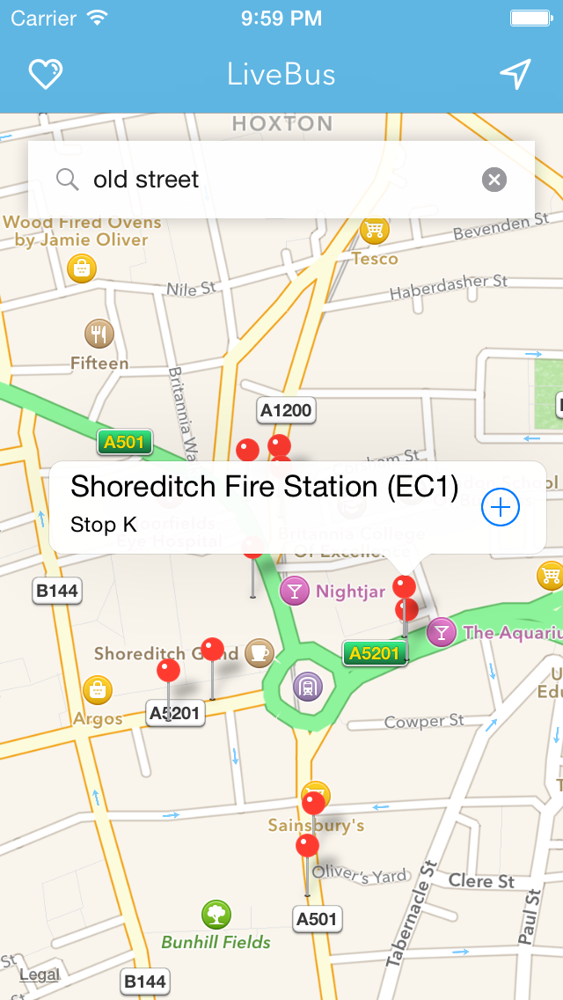
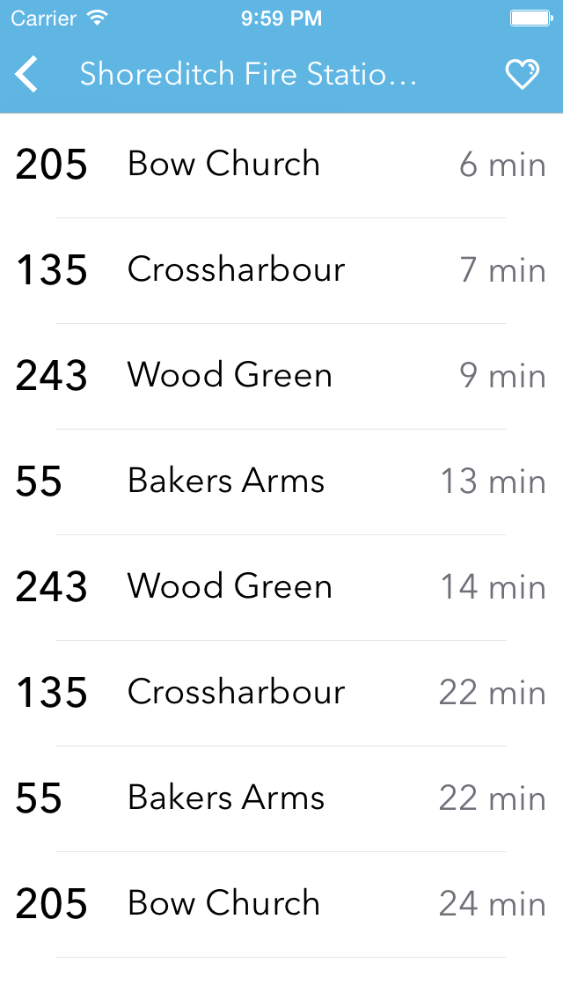
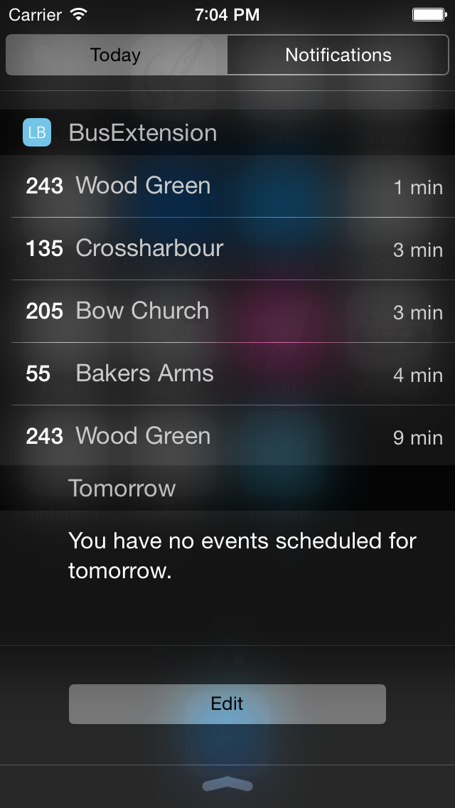

# LiveBusSwift
LiveBus is another small weekend project written in Swift. The purpose of this app is to get the live departure times for buses in London. While this is nothing really new the real difference is that you can add this app as a widget! I'm using the nice API from [TransportAPI](http://www.transportapi.com/) which includes a free allowance of 30k hits per month (perfect for testing!).

## Screenshots

  

## References
* [TransportAPI and its documentation](http://www.transportapi.com/)
* [App extension documentation from Apple](https://developer.apple.com/library/ios/documentation/General/Conceptual/ExtensibilityPG/NotificationCenter.html)
* [Icons from Amit Jakhu](https://dribbble.com/shots/1192074-Dripicons-Free-Iconset-GIF)